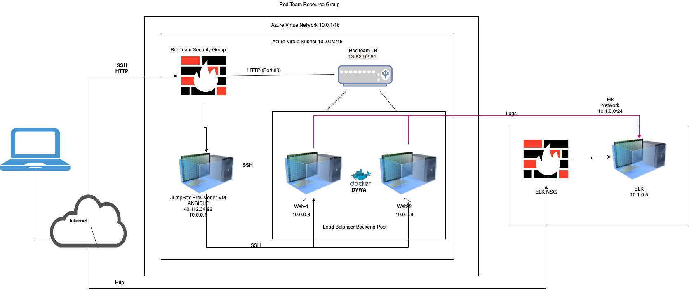

## Automated ELK Stack Deployment

The files in this repository were used to configure the network depicted below.

These files have been tested and used to generate a live ELK deployment on Azure. They can be used to either recreate the entire deployment pictured above. Alternatively, select portions of the playbook.yml file may be used to install only certain pieces of it, such as Filebeat.

Enter the playbook file._
[installelk.yml](Ansible/installelk.yml)
This document contains the following details:
- Description of the Topology
- Access Policies
- ELK Configuration
  - Beats in Use
  - Machines Being Monitored
- How to Use the Ansible Build

### Description of the Topology

The main purpose of this network is to expose a load-balanced and monitored instance of DVWA, the D*mn Vulnerable Web Application.

Load balancing ensures that the application will be highly available, in addition to restricting traffic to the network.
- What aspect of security do load balancers protect? What is the advantage of a jump box?
- The loadbalncer ensures the nework don't overload. The jumpbox allows you to access the virtual machines and ansible.  

Integrating an ELK server allows users to easily monitor the vulnerable VMs for changes to the metrics and system files.
- What does Filebeat watch for? Filebeats monitors the log files or locations thts specified, collects log events, and transfer them to Elasticssearch or Logstash for indexing. 
- What does Metricbeat record? The metricbeat receives the metrics and statistics that it collects and transfer them to output tats seecified such as Elasticsearch for indexing.

The configuration details of each machine may be found below.
_Note: Use the [Markdown Table Generator](http://www.tablesgenerator.com/markdown_tables) to add/remove values from the table_.

| Name     | Function   | IP Address       | Operating System | 
|----------|----------  |-------------- ---|----------------- | 
| Jump Box | Gateway    | 104.45.145.241   | Linux/Ubuntu     | 
| Web-1    |Webserver-1 | 10.0.0.7         | Linux/Ubuntu     |  
| Web-2    |Webserver-2 | 10.0.0.8         | Linux/Ubuntu     |                  
| Elk      | ELK Server | 10.1.0.5         | Linux/Ubuntu     |  

### Access Policies

The machines on the internal network are not exposed to the public Internet. 

Only the Jumpbox machine can accept connections from the Internet. Access to this machine is only allowed from the following IP addresses:
174.50.16.232

Machines within the network can only be accessed by Jumpbox. 

- Which machine did you allow to access your ELK VM? What was its IP address? 174.50.16.232
The jumpbox can access the Elk is 10.1.0.5 the jumpbox is 10.0.0.4
A summary of the access policies in place can be found in the table below.

| Name     | Publicly Accessible | Allowed IP Addresses |
|----------|---------------------|----------------------|
| Jump Box | Yes                 | 174.50.16.232       |
| Web-1    | No                  | 104.45.145.241       |
| Web-2    | No                  | 104.45.145.241       |

### Elk Configuration

Ansible was used to automate configuration of the ELK machine. No configuration was performed manually, which is advantageous because...
-  What is the main advantage of automating configuration with Ansible?_The most important advantage is that identical configuration can be automated and deployed to many machines, veersus deploying the configuration to each machine in an isolated manner. In a network topology with a larger number of machines, could have a huge business impact if deployed to each and every machine, one by one.

The playbook implements the following tasks: 
- On the Jumpbox machine Docker and Ansible, enabling playbook automation to push software services to other machines
- Added ELK VM to Hosts file under a separate Group header
- Run Playbook file via ansible-playbook command, therefore pushing tasks to all machines assigned/configured to receive

The following screenshot displays the result of running `docker ps` after successfully configuring the ELK instance.

(Images/docker_ps_output_elk.png)

### Target Machines & Beats
This ELK server is configured to monitor the following machines:
- Web-1: 10.0.0.7
- Web-1: 10.0.0.8

We have installed the following Beats on these machines:
- ELK Server, Web-1 & Web-2
- The ELK Stack installed are: MetricBeat & FileBeat

These Beats allow us to collect the following information from each machine:
- Metricbeat: collects mwtrics and system statistics
- Filebeat: log events

### Using the Playbook
In order to use the playbook, you will need to have an Ansible control node already configured. Assuming you have such a control node provisioned: 

SSH into the control node and follow the steps below:

- Copy the ansible.cfg file to /etc/ansible
- add the machine, its IP, and ansible_python_interpreter=/usr/bin/python3 to the hosts in the ansible.cfg as shown below:

/etc/ansible/hosts

[webservers] 10.0.0.4 ansible_python_interpreter=/usr/bin/python3 10.0.0.5 ansible_python_interpreter=/usr/bin/python3 10.0.0.6 ansible_python_interpreter=/usr/bin/python3

[elk] 10.1.0.4 ansible_python_interpreter=/usr/bin/python3

- Copy the install-elk.yml and filebeat-playbook.yml file to 
/etc/ansible.
- Update the install-elk.yml and filebeat-playbook.yml file to include the machine you want use the   playbooks on by changing the hosts name on the 3rd line.
- Run the playbook, and navigate to /etc/ansible/hosts

[webservers] 10.0.0.4 ansible_python_interpreter=/usr/bin/python3 10.0.0.5 ansible_python_interpreter=/usr/bin/python3 10.0.0.6 ansible_python_interpreter=/usr/bin/python3

[elk] 10.1.0.4 ansible_python_interpreter=/usr/bin/python3

Copy the install-elk.yml and filebeat-playbook.yml file to /etc/ansible.
Update the install-elk.yml and filebeat-playbook.yml file to include the machine you want use the playbooks on by changing the hosts name on the 3rd line.
Run the playbook, and navigate to 
http://20.115.132.3:5601/app/kibana 

_TODO: Answer the following questions to fill in the blanks:_
- Which file is the playbook? Where do you copy it? .yml files are playbook files that can be run with Ansible. Typically, it's copied into a container where ansible is installed to be deployed

- Which file do you update to make Ansible run the playbook on a specific machine? How do I specify which machine to install the ELK server on versus which to install Filebeat on?_
The Hosts file allows for grouping of machines so you can dictate where you want resources to be deployed

- Which URL do you navigate to in order to check that the ELK server is running?
Navigate to [VM_Public_IP:5601/app/kibana]

As a **Bonus**, provide the specific commands the user will need to run to download the playbook, update the files, etc._

1. Sudo docker start [container name]
2. sudo docker ps
3. sudo docker exec -ti [container name] bash
4. sudo ansible-playbook [.yml file to run]
